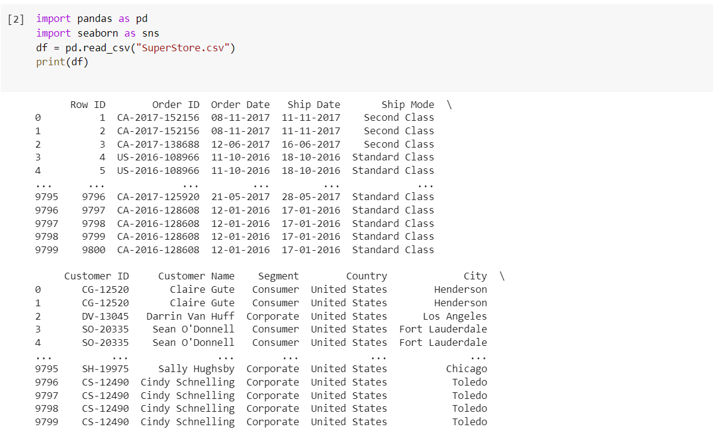
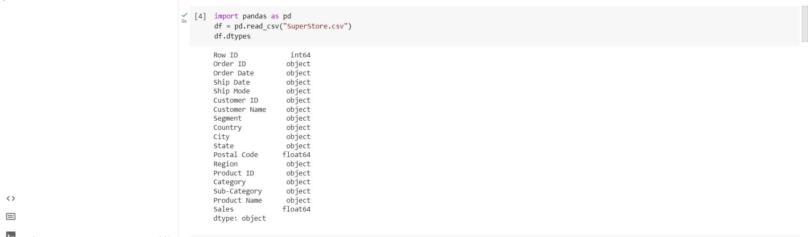
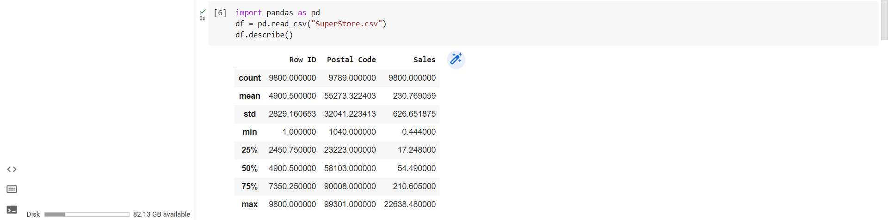
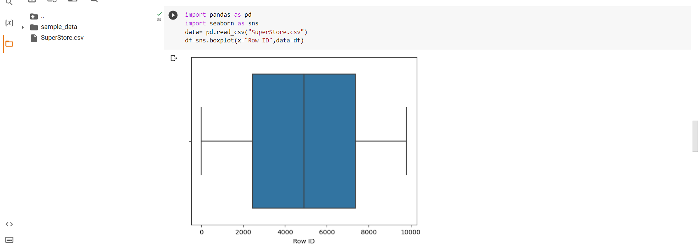
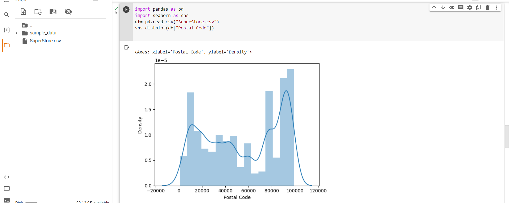
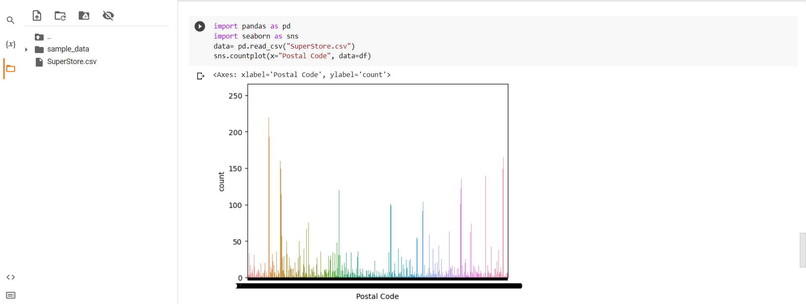
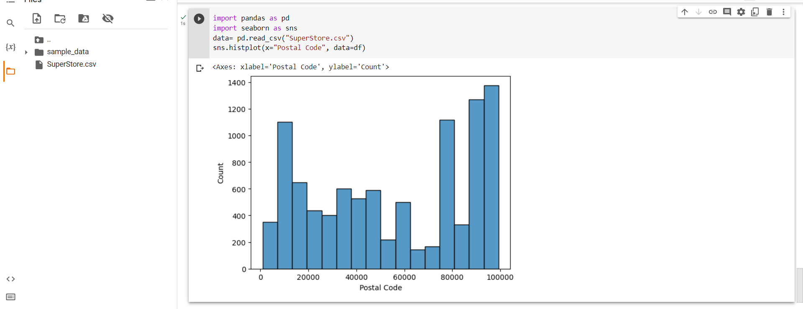

# Ex03-Univariate-Analysis
## code
```
import pandas as pd
import seaborn as sns
df = pd.read_csv("SuperStore.csv")
print(df)

import pandas as pd
df = pd.read_csv("SuperStore.csv")
df.info()

import pandas as pd
df = pd.read_csv("SuperStore.csv")
df.dtypes

import pandas as pd
df = pd.read_csv("SuperStore.csv")
df['City'].value_counts()

import pandas as pd
df = pd.read_csv("SuperStore.csv")
df.describe()

import pandas as pd
import seaborn as sns
data= pd.read_csv("SuperStore.csv")
df=sns.boxplot(x="Row ID",data=df)

import pandas as pd
import seaborn as sns
df= pd.read_csv("SuperStore.csv")
sns.distplot(df["Postal Code"])

import pandas as pd
import seaborn as sns
data= pd.read_csv("SuperStore.csv")
sns.countplot(x="Postal Code", data=df)

import pandas as pd
import seaborn as sns
data= pd.read_csv("SuperStore.csv")
sns.histplot(x="Postal Code", data=df)
```
## OUTPUT










## result 
the output  for program is executed sucsessfully